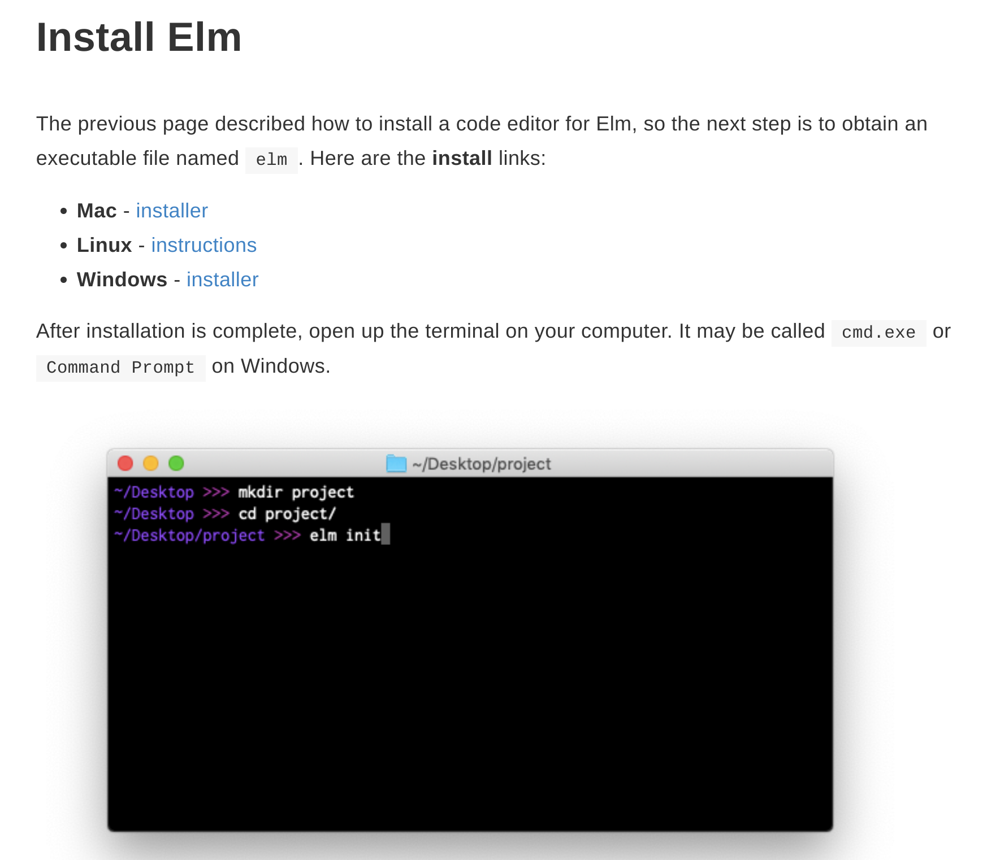
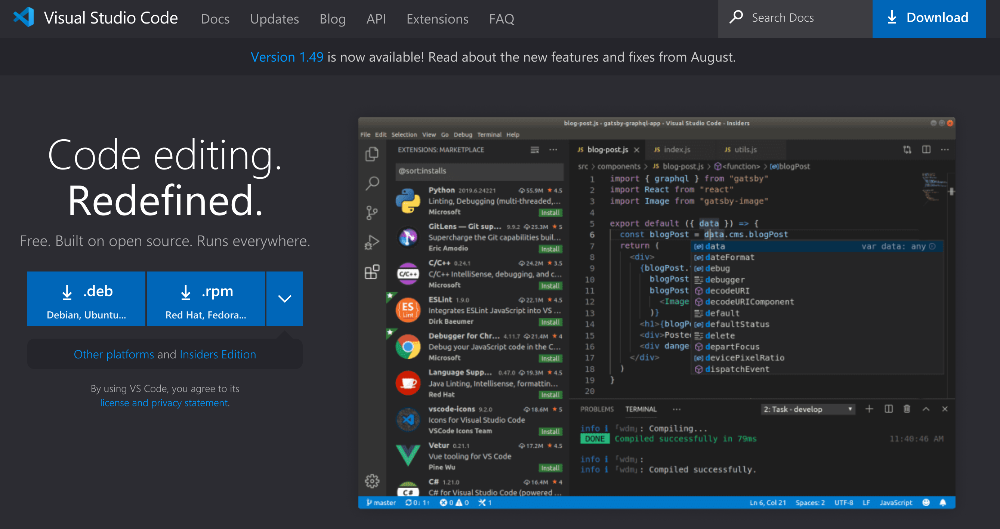
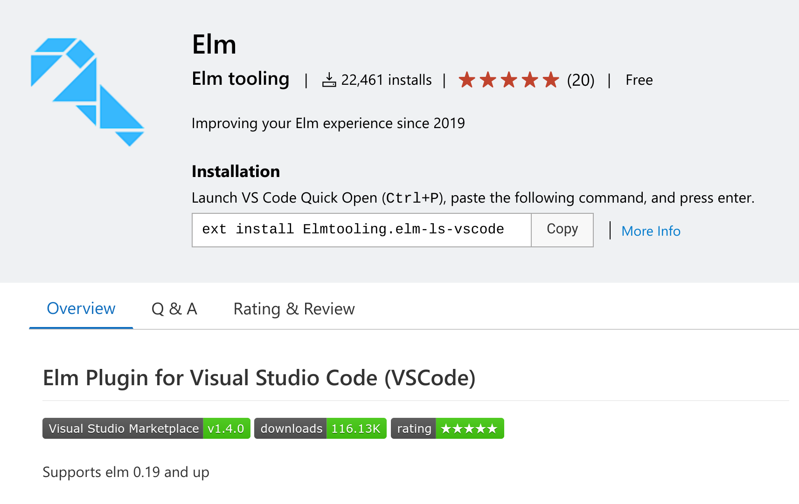

# Day 1

Welcome to your first day of Elm. Today we will be going through the basics of installing the Elm compiler and setting up the rest of your tools.

## Setup

### Installing ELm

The first thing we'll need is the Elm compiler. Head over to [the Elm docs](https://guide.elm-lang.org/install/elm.html) and select the installer for your computer.



We can verify this is installed properly by opening our command prompt and running

```
> elm --version
```

This guide is built around Elm v0.19.1 and that should be the version you see printed in your command prompt.

### Browser

This guide will be written using [Firefox](https://www.mozilla.org/en-US/firefox/new/), however Chrome menus will look very similar. If you're on a Mac and using Safari there will be some differences.

### Code Editor

This guide will be written using [Visual Studio Code](https://code.visualstudio.com/), aka VSCode. Don't feel obligated to use VSCode though. Some other excellent editors include: [Atom](https://atom.io/), [Vim](https://www.vim.org/), [IntelliJ IDEA](https://www.jetbrains.com/idea/), and many more.



If you're using IntelliJ then I recommend installing the [elm plugin](https://plugins.jetbrains.com/plugin/10268-elm). If you're using another editor then I recommend installing the [elm-lagnuage-server plugin](https://github.com/elm-tooling/elm-language-server#editor-support) for your editor. Since I'm using VSCode I will be using the [VSCode elm plugin](https://marketplace.visualstudio.com/items?itemName=Elmtooling.elm-ls-vscode).



## Exercises

1. Get accustomed to your editor of choice
1. Create, edit, and save some files in your editor
1. Search for other plugins or themes for your editor to make it look fun
1. Take a break and enjoy the weather, or move ahead to [day 2](../day_02)

[Solutions](./SOLUTIONS.md)
