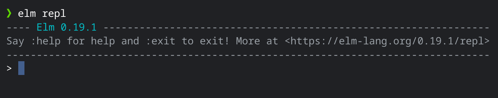
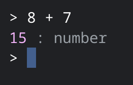
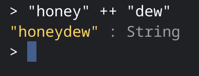
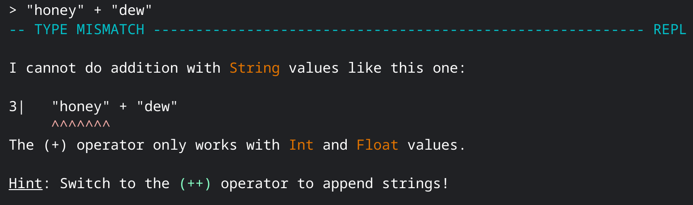
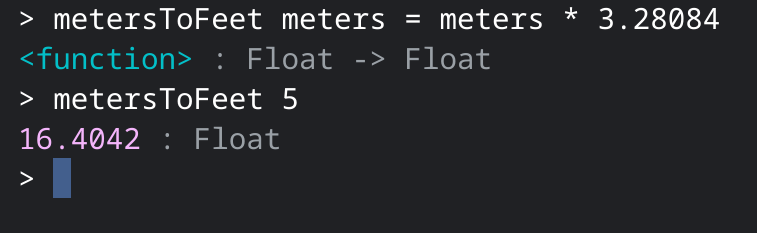

# Day 2 - Values & Functions

Welcome to your second day of Elm. Today we will be going covering _values_ and _functions_.

The smallest building blocks of Elm are _values_. These include numbers like `22`, strings like `"Hello friend!"`, and `True` or `False`. To try some of these out, let's open a REPL in our command prompt. On [Day 1](../day_01) we installed Elm which gives us access to the command `elm repl`. If you open your command prompt, type `elm repl` and press Enter. This should look like

### Values

If you want to leave the repl, type `:exit` and press Enter. But before doing that, let's test out some values! You can enter numbers like `5` or `497.55`. You can enter strings like `"Y'all"` or `"Saskatchewan"`. You can also do math, enter `8 + 7` and press Enter and you see it print out `15`.

In Elm you can also combine strings. Try typing `"honey" ++ "dew"`, note the two `+` for joining together strings, and press Enter. You should see `"honeydew"` printed out.

Don't worry if you accidentally use a single `+`! Elm will let you know where you made the mistake as well as suggestions for how to fix it. If you look at the picture below you can the `Hint:` suggest to use `++` when working with strings. It also mentions that `+` is used with `Int` and `Float`. We haven't gona over those yet but they're the names of numbers in Elm.

### Functions

Functions are an excellent complement to values. A function allows us to take values and transform them into new values. For example we might want to convert from meters to feet. To do this we'll write a function named `metersToFeet` that takes in 1 argument, some number of meters, and returns a new value, some number of feet. An argument is a value that is passed into a function. Type into your repl `metersToFeet meters = meters * 3.28084` and press Enter. You've just created your first function! Now you can see how many feet are in any number of meters. Try typing `metersToFeet 5` and press Enter. You should see a result of `16.4042`.

## Exercises

1. Create a function to greet someone.
1. Create a function that calculates at 10% tax on a purchase.
1. Create a function that takes multiple words and prints out a [mad lib](https://en.wikipedia.org/wiki/Mad_Libs).

[Solutions](./SOLUTIONS.md)
